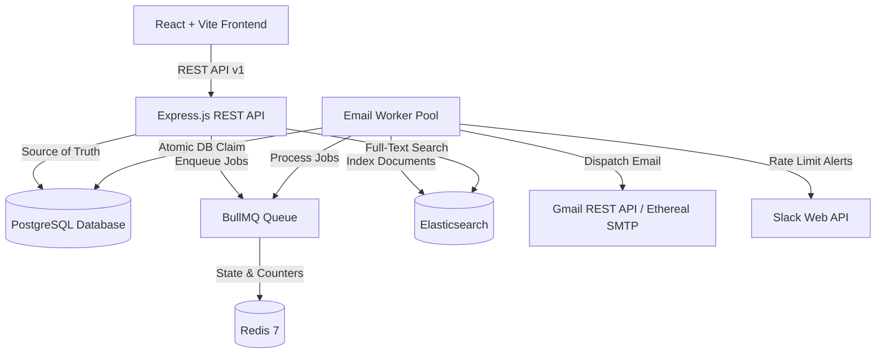

# 📬 ReachInbox Email Scheduler

A multi-tenant email scheduling and outreach platform built with **TypeScript**, **Express.js**, **BullMQ**, **Redis**, **PostgreSQL**, **Elasticsearch**, **Google OAuth 2.0**, and **Slack API Integration**.

---

## 🏗️ System Architecture



---

## ✨ Key Technical Features

1. **Multi-Tenant Google OAuth & Ethereal SMTP Dual Dispatch**:
   - Logged-in users dispatch emails using their authorized Google account via the Gmail REST API (`POST https://gmail.googleapis.com/gmail/v1/users/me/messages/send`).
   - Support for testing dispatches via Ethereal SMTP (`EMAIL_PROVIDER=ethereal`) with custom `From` headers and 0 ghost attachments.

2. **Atomic Idempotency & Concurrency Control**:
   - Employs PostgreSQL row-level atomic status claiming (`prisma.email.updateMany`) before job execution.
   - Prevents duplicate sends across high-concurrency worker pools (`WORKER_CONCURRENCY=5`).

3. **Event-Driven Scheduling & Rate Limiting (No Cron)**:
   - Uses BullMQ delayed jobs backed by Redis to orchestrate precise future dispatch times without application or OS cron jobs.
   - Enforces per-user hourly limits (`HOURLY_EMAIL_LIMIT=100`). Excess emails are deferred to the next hourly window via `job.moveToDelayed()`.

4. **Slack OAuth Integration & Alert Deduplication**:
   - Real Slack OAuth 2.0 flow for channel integration.
   - Triggers real-time Slack notifications when hourly limits are reached, deduplicated to 1 alert per user per hour using Redis TTL keys.

5. **Elasticsearch Multi-Field Full-Text Search**:
   - Indexes email records into Elasticsearch (`emails` index) with user-scoped isolation.
   - Automatically falls back to PostgreSQL search if the Elasticsearch node is offline.

6. **Queue Monitoring Dashboard**:
   - Bull Board dashboard available at `/admin/queues` for real-time visualization of queue metrics.
   - In production mode (`NODE_ENV=production`), access requires `BULL_BOARD_AUTH_KEY` header verification.

---

## 🚀 Local Development Setup

### Prerequisites
- Node.js (v18+)
- Docker & Docker Compose
- PostgreSQL 16
- Redis 7
- Elasticsearch 8.11

### 1. Launch Infrastructure Containers
```bash
docker compose up -d
```

### 2. Install & Start Backend
```bash
npm install
npx prisma migrate deploy
npm run dev
```

### 3. Install & Start Frontend
```bash
cd frontend
npm install
npm run dev
```
Access the application at `http://localhost:5173`.

---

## 🔑 Environment Configuration (`.env`)

| Variable | Required | Description |
|----------|----------|-------------|
| `PORT` | Yes | API server port (default `4000`) |
| `NODE_ENV` | Yes | Environment mode (`development` / `production`) |
| `DATABASE_URL` | Yes | PostgreSQL connection string |
| `REDIS_HOST` | Yes | Redis host (default `localhost` / `redis`) |
| `REDIS_PORT` | Yes | Redis port (default `6379`) |
| `JWT_SECRET` | Yes | Secret key for signing JWT tokens |
| `GOOGLE_CLIENT_ID` | Yes | Google OAuth 2.0 Client ID |
| `GOOGLE_CLIENT_SECRET` | Yes | Google OAuth 2.0 Client Secret |
| `GOOGLE_REDIRECT_URI` | Yes | Google OAuth callback URL |
| `FRONTEND_URL` | Yes | Allowed frontend origin for CORS |
| `EMAIL_PROVIDER` | Yes | Provider strategy (`gmail`, `ethereal`, `smtp`) |
| `ETHEREAL_HOST` | No | Ethereal SMTP host (`smtp.ethereal.email`) |
| `ETHEREAL_PORT` | No | Ethereal SMTP port (`587`) |
| `SMTP_HOST` | No | SMTP host for custom transport |
| `SMTP_PORT` | No | SMTP port for custom transport |
| `SMTP_USER` | No | SMTP authentication username |
| `SMTP_PASS` | No | SMTP authentication password |
| `EMAIL_FROM` | Yes | Default sender display header |
| `ELASTICSEARCH_NODE` | Yes | Elasticsearch endpoint (`http://localhost:9200`) |
| `WORKER_CONCURRENCY` | Yes | Concurrency per worker instance (default `5`) |
| `WORKER_COUNT` | Yes | Number of worker processes (default `2`) |
| `HOURLY_EMAIL_LIMIT` | Yes | Hourly dispatch quota per user (default `100`) |
| `MIN_EMAIL_DELAY_MS` | Yes | Minimum delay between dispatches (default `1000`) |
| `SLACK_CLIENT_ID` | No | Slack OAuth Client ID |
| `SLACK_CLIENT_SECRET` | No | Slack OAuth Client Secret |
| `SLACK_REDIRECT_URI` | No | Slack OAuth callback URL |
| `BULL_BOARD_AUTH_KEY` | Production | Admin authorization key for `/admin/queues` |

---

## 🎬 5-Minute Evaluator Demo Guide

1. **Google Login**: Open `http://localhost:5173` and click **Google Login**. User profile information will populate.
2. **Compose Email**: Go to **Scheduled Emails** → **Compose Email**. Input recipients (or upload CSV), set subject/body, choose start time, and schedule dispatch.
3. **Queue Monitoring**: Open `http://localhost:4000/admin/queues` to inspect live queue counters.
4. **Real-Time Sync**: Observe state updates (`QUEUED` → `PROCESSING` → `SENT`) in the dashboard.
5. **Sent Verification**: Verify dispatched emails in the user's Gmail `Sent Mail` folder or Ethereal output.
6. **Elasticsearch Search**: Perform a full-text query using the top search bar.
7. **Slack Alerting**: Connect Slack in settings, trigger the rate limit, and verify the formatted alert in Slack.

---

## 📌 OAuth Setup Notes

- **Google OAuth Testing Mode**: While the Google Cloud app is in *Testing* publishing status, authorized accounts must be added under **Test Users** in the Google Cloud Console.
- **Slack OAuth**: In production, update the Slack App Redirect URI to match your public HTTPS callback domain (`https://<your-domain>/api/v1/slack/callback`).

---

## 🌐 Production Deployment & Free-Tier Notes

- **Oracle Cloud Infrastructure (OCI) Always Free**: Designed to run within OCI Always Free Ampere A1 limits (up to 2 OCPUs, 12 GB RAM total per tenancy, and 200 GB Block Storage) with $0 expected infrastructure cost while within quotas.
- **Idle Policy Notice**: OCI reserves the right to reclaim Always Free compute instances if official CPU, memory, and network idle criteria are met over a 7-day period.
- **No Cron Architecture**: The system uses BullMQ delayed queues and PostgreSQL state persistence for scheduling and restart recovery. Application or OS cron jobs are not used.

## 🗓️ Development Progression

*Note: This section summarizes the development progression and major capabilities completed during implementation; it is not a reconstruction of Git commit timestamps.*

### September 1 — Foundation & Core Scheduler
- Express.js + TypeScript backend foundation
- Prisma ORM & PostgreSQL database schema migrations
- Redis connection & BullMQ delayed email queue integration
- Baseline Vite React client layout & navigation structure
- Email dispatch API endpoint & persistence data models

### September 2 — Integrations & Services
- Google OAuth 2.0 user authentication flow
- Gmail REST API multi-tenant email dispatch engine
- Ethereal SMTP Nodemailer transport for testing
- Elasticsearch multi-field full-text search integration
- Slack OAuth 2.0 & deduplicated rate-limit alerts
- Compose editor with contentEditable rich text & attachment handling

### September 3 — Hardening & Submission
- Startup queue scanner for server restart job recovery
- Atomic row-level database status claiming (`prisma.email.updateMany`)
- Bull Board monitoring dashboard with production auth protection
- Shared Redis hourly rate limiting (`HOURLY_EMAIL_LIMIT=100`)
- Docker Compose production volume persistence & healthchecks
- Repository audit, security secret scanning, and GitHub submission

---

## 📋 Assignment Requirements Compliance

| Requirement | Implementation Status |
|-------------|-----------------------|
| **TypeScript / Node / Express** | Fully implemented in backend & frontend |
| **BullMQ & Redis Scheduler** | Fully implemented; 0 cron jobs used |
| **PostgreSQL Schema & Persistence** | Fully implemented via Prisma ORM |
| **Ethereal SMTP & Gmail API** | Dual provider support with clean MIME output |
| **Elasticsearch Integration** | User-scoped search with PostgreSQL fallback |
| **Bull Board Dashboard** | Mounted at `/admin/queues` with production auth protection |
| **Idempotency & Concurrency** | Atomic row-level database claiming enforced |
| **Slack Integration** | Real Slack OAuth & deduplicated rate-limit alerts |
